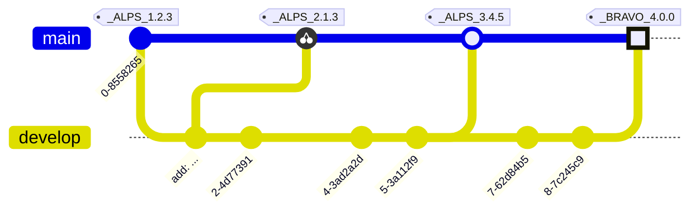

# RELEASE NOTES

All notable changes to this project will be documented in this file.

The format is based on [Keep a Changelog](https://keepachangelog.com/en/1.0.0/),
and this project adheres to a flavor of [Semantic Versioning](https://semver.org/spec/v2.0.0.html)
which includes [Scopes and Epochs](#epoch-scoped-semver).

---


-----------------------

# Generator

### [UNRELEASED](https://github.com/shayanhabibi/Partas.Feliz.Generator/compare/_%28Generator%29_0.6.0...HEAD)

### [0.6.0](https://github.com/shayanhabibi/Partas.Feliz.Generator/compare/_%28Generator%29_0.5.0..._%28Generator%29_0.6.0) - (2025-10-02)

#### <!-- 1 --> Added

* new macro funcs by [@cabboose](https://github.com/cabboose) with [#d6fee](https://github.com/shayanhabibi/Partas.Feliz.Generator/commit/d6feed10b01350e9b73a500e790b24b3875f43de)
  

### [0.5.0](https://github.com/shayanhabibi/Partas.Feliz.Generator/compare/_%28Generator%29_0.4.0..._%28Generator%29_0.5.0) - (2025-10-02)

#### <!-- 1 --> Added

* supports number and boolean enums. more config options by [@cabboose](https://github.com/cabboose) with [#bd29f](https://github.com/shayanhabibi/Partas.Feliz.Generator/commit/bd29fa751518703682aead04d04d9de3a9a3e6df)
  

### [0.4.0](https://github.com/shayanhabibi/Partas.Feliz.Generator/compare/_%28Generator%29_0.3.0..._%28Generator%29_0.4.0) - (2025-10-02)

#### <!-- 1 --> Added

* add 'object' function for attribute types by [@cabboose](https://github.com/cabboose) with [#84c96](https://github.com/shayanhabibi/Partas.Feliz.Generator/commit/84c96f9a89df4590830df5986cfaf9b485357fb0)
  

### [0.3.0](https://github.com/shayanhabibi/Partas.Feliz.Generator/compare/_%28Generator%29_0.2.2..._%28Generator%29_0.3.0) - (2025-10-02)

#### <!-- 6 --> Others

* namespace field and requiredopens field for header namespace and following required modules to open by [@cabboose](https://github.com/cabboose) with [#5cba4](https://github.com/shayanhabibi/Partas.Feliz.Generator/commit/5cba45d1261f57e4366bb24a751d4252c8414b1d)
  

### [0.2.2](https://github.com/shayanhabibi/Partas.Feliz.Generator/compare/_%28Generator%29_0.2.1..._%28Generator%29_0.2.2) - (2025-10-02)

#### <!-- 2 --> Fixed

* fix name of attribute being normalized in expr instead of just in method identifier by [@cabboose](https://github.com/cabboose) with [#6838a](https://github.com/shayanhabibi/Partas.Feliz.Generator/commit/6838ace165cb78fb504d16f2e5cff5d58b10b55a)
  

### [0.2.1](https://github.com/shayanhabibi/Partas.Feliz.Generator/compare/_%28Generator%29_0.2.0..._%28Generator%29_0.2.1) - (2025-10-02)

#### <!-- 2 --> Fixed

* Also add identifier `numberArray` as shortcut to 'float array' and 'int array' by [@cabboose](https://github.com/cabboose) with [#a2add](https://github.com/shayanhabibi/Partas.Feliz.Generator/commit/a2adda17daf404059b74825034f2da87ecc3d6ae)
  

### [0.2.0](https://github.com/shayanhabibi/Partas.Feliz.Generator/compare/_%28Generator%29_0.1.1..._%28Generator%29_0.2.0) - (2025-10-02)

#### <!-- 1 --> Added

* Add ident `number` as shortcut to "float" & "int" by [@cabboose](https://github.com/cabboose) with [#3a0db](https://github.com/shayanhabibi/Partas.Feliz.Generator/commit/3a0db25f572eedcda22c54d1cf1c8a247557bbad)
  

### [0.1.1](https://github.com/shayanhabibi/Partas.Feliz.Generator/compare/_%28Generator%29_0.1.0..._%28Generator%29_0.1.1) - (2025-10-02)

#### <!-- 2 --> Fixed

* Add 'use' to the reserved name list by [@cabboose](https://github.com/cabboose) with [#ddb9e](https://github.com/shayanhabibi/Partas.Feliz.Generator/commit/ddb9e65a9e69452dcc24f33f4c012354c8085682)
  

<div align="right"><a href="#quick-navigation">(back to top)</a></div>

-----------------------


---

<details>
<summary>Read more about this SemVer flavor</summary>

### Epoch Scoped SemVer

This flavor adds an optional marketable value called an `EPOCH`.
There is also an optional disambiguating `SCOPE` identifier for delineating tags for packages in a mono repo.

<blockquote>The motivation for this is to prevent resistance to utilising SemVer major bumps
correctly, by allowing a separate marketable identifier which is easily compatible
with the current SemVer spec.</blockquote>


An Epoch/Scope (*Sepoch*) is an OPTIONAL prefix to a typical SemVer.

* A Sepoch MUST BE bounded by `_` underscores `_`.
* The identifiers MUST BE ALPHABETICAL (A-Za-z) identifiers.
* The Epoch SHOULD BE upper case
* The Epoch MUST come before the Scope, if both are present.
* The Scope MUST additionally be bounded by `(` parenthesis `)`.
* The Scope SHOULD BE capitalised/pascal cased.
* A Sepoch CAN BE separated from SemVer by a single white space where this is allowed (ie not allowed in git tags).
* Epoch DOES NOT influence precedence.
* Scope MUST uniquely identify a single components versioning.
* Different scopes CANNOT BE compared for precedence.
* A SemVer without a Scope CAN BE compared to a Scoped SemVer for compatibility. But caution is advised.

> There is no enforcement for ordering EPOCHs in this spec, as it
would be overly restrictive and yield little value since we can delineate and
earlier EPOCH from a later EPOCH by the SemVers.

#### Example



*While there are breaking changes between versions 1 to 3, we expect that it is less than
from 3 to 4. We expect the API surface would change more dramatically, or there is some other significant
milestone improvement, in the change from version 3 epoch ALPS to version 4 epoch BRAVO.*

```
_WILDLANDS(Core)_ 4.2.0
_WILDLANDS(Engine)_ 0.5.3
_DELTA(Core)_ 5.0.0
_DELTA(Engine)_ 0.5.3
```

*Cannot be compared to `Core` versions. Both Engine versions are equal, we can identify that
the ecosystems marketed change does not change the Engine packages API*

</details>

<!-- generated by Partas.GitNet -->
